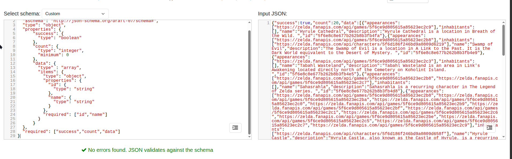
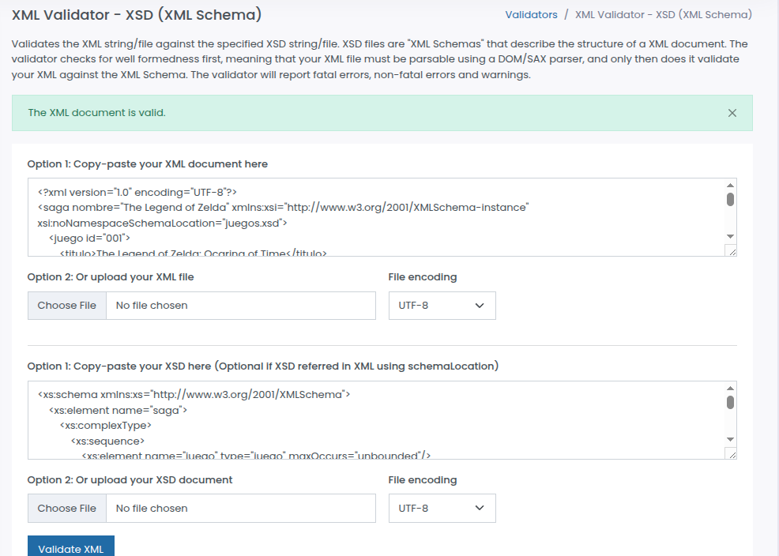

# Proyecto: Enciclopedia Hyrule

## Descripción del proyecto

Enciclopedia Hyrule es una plataforma web diseñada para la exploración, consulta y gestión personalizada de información relativa a la saga The Legend Of Zelda. 
La aplicación actúa como un agregador de datos que combina fuentes en tiempo real y gestión de datos persistentes en la nube.

La arquitectura de la plataforma ha sido diseñada basándose en tres pilares fundamentales:

### Exploración y Recuperación de Datos Dinámicos:

La aplicación hace uso de una API REST externa (API de Zelda) para proporcionar información actualizada sobre el universo del juego. 

De la misma forma, la interfaz de búsqueda permite la consulta en tiempo real, optimizada mediante un mecanismo de debounce que minimiza la carga innecesaria de peticiones al servidor. 

Gracias a este enfoque se garantiza una experiencia de usuario fluida, adaptándose a diversos tipos de entidades del universo de The Legend Of Zelda.

### Persistencia

El proyecto emplea una arquitectura de almacenamiento de dos niveles para maximizar el rendimiento y la experiencia del usuario:

- Caché Local (localStorage): Utilizada para las consultas a la API, ya que al almacenar los resultados de búsquedas previas, se reduce la latencia y se evita el consumo innecesario de la API externa.

- Almacenamiento en la Nube (Firebase Firestore): Destinado a la gestión de favoritos del usuario, garantizando la persistencia de los datos entre diferentes sesiones y dispositivos, permitiendo al usuario construir su biblioteca personalizada sin importar el dispositivo de acceso.

### Garantía de Calidad y Validaciones

Con tal de asegurar la integridad de la información y la robustez del código, se han hecho uso de validadores de esquemas tanto para los datos JSON entrantes como para los documentos XML.

Cabe destacar que, mediante el uso de JSON Schema para validar las respuestas de la API se han conseguido evitar errores de ejecución y ha ayudado a asegurar que toda la información procesada sea consistente y válida.

## Tecnologías y herramientas

Para el desarrollo de este proyecto, he definido un stack tecnológico centrado en la eficiencia y la mínima dependencia de librerías externas.

En todo momento, mi objetivo ha sido crear una aplicación robusta que cumpla con los estándares actuales de desarrollo web, como se muestra a continuación:

### Interacción con API REST

Para la comunicación con la Zelda API, he optado por utilizar la Fetch API nativa de JavaScript, cuya implementación puedes ver en `assets/js/api.js`

- **Mi decisión**: He preferido usar fetch directamente por ser una solución nativa, lo cual mantiene el proyecto ligero y sin dependencias innecesarias.
- **Alternativa considerada**: Evalué el uso de Axios, ya que aunque es una librería muy potente y con una gestión de errores más sencilla, consideré 
que para la escala de este proyecto, fetch es más que suficiente y me permite cumplir con el objetivo de optimización sin inflar el tamaño de la aplicación.

### Procesamiento y Conversión de Datos

Para gestionar el catálogo de juegos (juegos.xml) y su posterior exportación a CSV, he tenido que tratar con diferentes formatos de intercambio de información.
Mis decisiones se basan en la legibilidad del código y la facilidad de mantenimiento.

#### Conversión XML a JSON: 

Para procesar el archivo `data/juegos.xml`, he implementado la librería `xml2js`
- **Por qué la elegí**: Al principio valoré usar DOMParser (que es nativo del navegador), pero el código para navegar por el árbol de nodos XML me resultaba demasiado verboso y propenso a errores, 
por lo que finalmente decidí integrar `xml2js` porque me permite convertir la estructura XML a un objeto JSON de forma casi directa y mucho más limpia, lo que me ha facilitado enormemente el acceso a
los atributos (como el id en la etiqueta <juego>) y a los valores anidados, dejando mi archivo `assets/js/transform.js` mucho más ordenado y fácil de leer.

- **Alternativas consideradas**:
  - DOMParser: Es nativo, lo que ahorra peso en la carga, pero tras probarlo vi que la lógica de conversión manual me obligaba a escribir demasiadas líneas de código innecesarias.
  - fast-xml-parser: Es una opción muy rápida, pero para el volumen de datos que maneja este proyecto, sin duda alguna, `xml2js` me ofrecía una sintaxis mucho más intuitiva y una integración más rápida para el desarrollo de esta entrega.
   
#### Conversión JSON a CSV

Para la exportación del catálogo a CSV, he optado por una lógica de generación de archivos propia.

- **Mi decisión**: Dado que los datos ya están estructurados como objetos JSON tras la conversión anterior, simplemente he implementado una función que mapea los campos del objeto a filas de texto separadas por comas.
- **Alternativas**: Podría haber usado `PapaParse` para garantizar que el CSV esté correctamente escapado (por si algún título de juego contuviera comas), pero dado que el catálogo es controlado y conocido, he preferido 
mantener una implementación sencilla que no dependa de librerías de terceros, manteniendo el proyecto lo más ligero posible.

### Capas del almacenamiento

He diseñado una arquitectura híbrida de almacenamiento para separar la caché del usuario de sus datos persistentes:

#### localStorage(Caché):

Lo uso exclusivamente para cachear los resultados de las búsquedas en `assets/js/api.js`
Consideré que es la solución ideal para hacer las búsquedas rápidas y eficiente, con tal de evitar peticiones repetidas a la API.
Finalmente, cabe destacar que descarté sessionStorage porque quería que la caché fuera persistente.

#### Firebase Firestore

Lo utilizo para guardar los favoritos del usuario (configurado en `assets/js/firebase.js`)

A diferencia de localStorage, Firestore me permite sincronizar los datos en la nube, garantizando que el usuario pueda ver sus favoritos desde cualquier dispositivo.

Cabe destacar que actualmente opero en "modo test". Soy consciente de que en un entorno de producción real, esto requeriría configurar reglas de seguridad avanzadas en la consola de Firebase
para restringir el acceso a los datos únicamente al usuario propietario de la cuenta.

#### Tecnologías de validación

Con el fin de asegurar que los datos recibidos son acorde al formato requerido he utilizado:

- **JSON Schema**: He creado `schemas/entidad_schema.json` para validar la respuesta de la Zelda API. 
Esto me asegura que, si la API cambia o falla, mi código reciba exactamente lo que espera (name, description, etc.).

- **XSD (XML Schema Definition)**: He vinculado `data/juegos.xsd` con el archivo XML original usando `xsi:noNamespaceSchemaLocation`.
Esto me permite validar que el catálogo de juegos cumpla con los tipos de datos correctos (como xs:integer para los años y puntuaciones), algo que no podría hacer tan fácilmente sin este esquema.

## La Zelda API

Para dar vida a la enciclopedia y permitir que el usuario explore el universo de Zelda, he integrado la [API de Zelda](https://zelda.fanapis.com/). 
Mi decisión de utilizar esta API ha sido principalmente a que es un servicio RESTful bien estructurado, lo que me ha permitido consumir recursos de manera sencilla y dinámica.

### Implementación y arquitectura de consulta

He implementado el consumo de la API en el archivo `assets/js/api.js.`
En lugar de crear funciones aisladas para cada tipo de entidad, he diseñado una arquitectura de consulta flexible, explicada a continuación:

- **Implementación de endpoints**: A diferencia de una implementación básica, he implementado todos los endpoints de categorías disponibles (personajes, monstruos, objetos, juegos, etc.). 
Esto lo logré parametrizando la URL base en mis funciones de fetch, lo que permite que la aplicación escale si decido añadir más tipos de datos en el futuro sin tener que reescribir la lógica de la consulta a la API

- **Uso de parámetros**: He aprovechado la capacidad de la API para filtrar resultados mediante el uso de los template strings en mis peticiones fetch, gestiono la búsqueda en tiempo real y el filtrado por nombre, optimizando el tráfico de red de la API.

### Gestión de estado y errores

Para cumplir con los criterios de calidad, he pulido la interacción con la API con tal de que el usuario nunca vea una pantalla en blanco si algo falla:

- **Async/Await**:Toda la interacción es asíncrona, lo que evita que la interfaz se bloquee mientras espero la respuesta del servidor.

- **Gestión de errores**: He implementado bloques try/catch en mis llamadas, ya que si la API devuelve un código de error (como un 404 Not Found al no hallar una entidad o un 500 por fallo del servidor),
mi código intercepta la respuesta y muestra un mensaje de error claro en la interfaz (a través de ui.js), asegurando una experiencia amigable con el usuario.

## Formato de datos

En este proyecto, he trabajado con tres tipos de formatos fundamentales para el intercambio de información: JSON, XML y CSV.

### JSON

Es el formato que utilizo como "idioma nativo" dentro de la aplicación el cual se caracteriza por ser ligero, basado en texto y estructurado en pares clave-valor.

Lo he empleado en el proyecto principalmente porque es el formato estándar de la Zelda API, ya que al ser un objeto nativo de JavaScript, su integración es inmediata, sin necesidad de parseos complejos.

De la misma forma, lo he utilizado para la comunicación con la API externa y como formato intermedio tras convertir el XML.
Gracias a su estructura, me ha permitido manipular los datos de forma directa en mi código, lo que ha mejorado considerablemente la velocidad de respuesta de la interfaz.

### XML

A diferencia de JSON, es mucho más descriptivo y está diseñado no solo para el transporte de datos, sino para la estructuración de documentos.

Lo he usado en el proyecto en el archivo `data/juegos.xml` para almacenar información del catálogo de juegos.
Aunque es más verboso, su capacidad de validación mediante XSD me permite asegurar que los datos del catálogo siempre tengan 
la estructura correcta antes de procesarlos. 

### CSV

Es el formato de texto más sencillo, donde los datos se organizan en filas y columnas separadas por comas.

En el proyecto lo he destinado exclusivamente a la exportación de datos, principalmente porque aunque JSON y XML son mejores 
para el intercambio de datos entre sistemas, el CSV es el rey en cuanto a la experiencia con el usuario final, ya que permite que el
catálogo se descargue en formato CSV, garantizando que cualquier usuario pueda abrir los datos en programas como Microsoft Excel o Google Sheets sin 
necesidad de tener conocimientos técnicos.

## Esquemas

Para garantizar la integridad y calidad de los datos que procesa la aplicación, he implementado una capa de validación estricta utilizando JSON Schema para los datos dinámicos de la API 
y XSD (XML Schema Definition) para el catálogo de juegos en XML.

### JSON Schema (`schemas/entidad_schema.json`)

He creado este esquema para validar la estructura de los objetos que recibo de la Zelda API. 

Al ser una fuente externa, es vital asegurar que los datos cumplen con mis expectativas antes de intentar renderizarlos en el DOM.
En este esquema he validado principalmente la estructura de los campos comunes (`id`,`name` y `description`) y 
además he marcado como `required` los campos `id` y `name`, todo con la intención de que mi lógica en
`assets/js/ui.js` pueda depender sin problemas de estos campos para generar los identificadores únicos de los elementos (para los favoritos)
y para mostrar el título en las tarjetas, puesto que si un objeto careciera de estos campos, la interfaz fallaría o mostraría elementos "vacíos", 
por lo que este esquema actúa como una primera barrera de defensa.

### XSD (data/`juegos.xsd`)

Para validar el catálogo de juegos (`data/juegos.xml`), he diseñado un esquema XSD que impone restricciones de tipo de datos, el cual valida
la estructura jerárquica de `<saga> -> <juego>`.

Para empezar he definido explícitamente los campos `anio` y `puntuacion` como xs:integer, dado que al realizar la conversión a JSON, necesito 
operar numéricamente con estos valores (por ejemplo, para ordenar juegos por puntuación o año), y por lo que si el XML original contuviera texto
en lugar de números, el proceso de conversión o de ordenación fallaría.

Finalmente, cabe destacar que el archivo `juegos.xml` está enlazado directamente al esquema mediante 
el atributo `xsi:noNamespaceSchemaLocation`, permitiendo que cualquier editor XML valide el documento en tiempo real.

### Evidencia de validación

Para verificar que mis esquemas son correctos, he realizado pruebas de validación.
A continuación, presento las capturas que demuestran que tanto el JSON como el XML cumplen con las reglas definidas:

#### JSON Schema

#### XSD

## Almacenamiento

Para la gestión de datos en la Enciclopedia Hyrule, he diseñado una arquitectura híbrida (localStorage + Firebase).
He tomado esta decisión basándome en el ciclo de vida de los datos, ya que mientras que una búsqueda es efímera, la lista de favoritos pertenece al propio usuario.

He decidido utilizar herramientas distintas para la caché y para los favoritos para aprovechar las ventajas específicas de cada tecnología:

### localStorage para la Caché:

En mi código (`assets/js/api.js`), utilizo el localStorage para almacenar los resultados de las peticiones a la Zelda API, lo que me aporta
un acceso local y extremadamente rápido, puesto que al usar una clave compuesta (tipo de entidad + término de búsqueda), puedo recuperar datos
de forma instantánea sin realizar una petición de red, lo que acaba suponiendo ahorro en ancho de banda de la API y mejora drásticamente la 
experiencia de usuario al eliminar tiempos de espera en búsquedas repetidas.

### Firebase Firestore para los Favoritos

Para la gestión de favoritos (`assets/js/firebase.js`), he optado por una base de datos NoSQL en la nube principalmente debido a la persistencia
multidispositivo, dado que al estar en la nube los favoritos no dependen de un navegador específico, es decir, si el usuario marca un monstruo como
favorito en su portátil, su selección aparecerá automáticamente cuando abra la aplicación en su móvil o en otro navegador, algo que sería imposible solo con tecnologías locales.

### Limitaciones de localStorage

Aunque localStorage es una herramienta potente, he descartado su uso para los favoritos debido a sus limitaciones críticas:

- **Ámbito local**: Los datos están vinculados exclusivamente al navegador y dispositivo actual.
- **Capacidad**: Está limitado a unos 5-10MB de texto, y aunque parece mucho, es un límite rígido que no permite escalar si el volumen de datos crece.
- **Fragilidad**:Es muy sencillo que el usuario borre estos datos accidentalmente al realizar una "limpieza de caché" o que el sistema operativo los elimine si necesita espacio en disco.
- *+Seguridad y tipado**: Solo permite almacenar cadenas de texto (strings), lo que me obliga a usar `JSON.stringify` y `JSON.parse` constantemente, aumentando la posibilidad de errores de sintaxis si el dato se corrompe.

### Reglas de Seguridad en Firestore

Las reglas de seguridad de Firestore son el mecanismo que permite definir quién tiene permiso para leer, crear, modificar o eliminar documentos en mi base de datos.
En este proyecto se opera en "modo test" o que significa que cualquier persona con mi configuración puede acceder a los datos, es decir, es una configuración útil para
el desarrollo ágil, pero inviable en producción, dado que en un entorno real, las reglas se configurarían para que un usuario solo pueda leer o escribir en documentos donde
el campo userId coincida con su identificador de sesión (request.auth.uid), garantizando la sseguridad.

### Alternativas consideradas

He evaluado otras tecnologías antes de decidirme por este modelo:

#### sessionStorage

La usaría si los datos solo debieran existir mientras la pestaña está abierta.
En mi caso, quería que la caché de búsqueda sobreviviera al cierre del navegador, por lo que elegí localStorage.

#### Cookies

Son ideales para gestionar sesiones de usuario o tokens de autenticación pequeños que el servidor necesita leer. 
Sin embargo, al ser datos más pesados (objetos de la API), las cookies eran inviables por tamaño y rendimiento.

#### IndexedBD

Es la opción para bases de datos locales complejas y de gran volumen.
La usaría si la enciclopedia necesitara funcionar totalmente offline con miles de registros de imágenes, por 
lo que para una caché de texto simple, la simplicidad de localStorage es mucho más eficiente en términos de desarrollo.

## Decisiones técnicas

A lo largo del desarrollo de la Enciclopedia Hyrule, me he encontrado con varios retos arquitectónicos. 
Para resolverlos, he priorizado el rendimiento de la aplicación y la mantenibilidad del código.

A continuación, detallo y justifico las principales decisiones técnicas que he tomado:

### Implementación de un patrón Debounce en el buscador

El requisito exigía que la búsqueda se lanzara automáticamente mientras el usuario escribía, sin necesidad de 
pulsar un botón de "Buscar", lo que suponía un problema  que por cada letra que el usuario escribiera la aplicación 
lanzaría peticiones por cada una de ellas.

Esto genera tres problemas graves: saturación de la red, riesgo de ser bloqueados por la API (error 429 Too Many Requests) y condiciones de carrea 
(donde una petición antigua tarda más en responder que una nueva, mostrando resultados incorrectos en pantalla).

Por lo que finalmente decidí implementar una función de debounce (temporizador) en la lógica del buscador.

Gracias a esta decisión, el código detecta cada pulsación de tecla pero reinicia un temporizador de unos 300 milisegundos, 
en donde la petición fetch real a la API solo se ejecuta cuando el usuario deja de escribir, reduciendo drásticamente el consumo de datos,
aliviando la carga en el servidor externo y mejorando la fluidez de la interfaz.

### Arquitectura modular y separación de responsabilidades

Al trabajar con manipulación del DOM, llamadas a APIs externas, transformación de XML y bases de datos en la nube, el código puede convertirse rápidamente 
en lo que se conoce como "código espagueti".

Por lo que en lugar de crear un único y gigantesco archivo `main.js`, he dividido el proyecto en módulos con responsabilidades únicas y estrictas: 
`api.js` (comunicación externa y caché), `firebase.js` (base de datos en la nube), `transform.js` (procesamiento y exportación) y `ui.js` (renderizado y eventos del DOM).

Esta separación garantiza que las distintas partes del programa estén desacopladas. 
Por ejemplo, mi archivo `ui.js` no sabe de dónde vienen los datos, solo sabe cómo dibujarlos, facilitando 
que si en el futuro decido cambiar Firebase por otra tecnología, solo tendré que reescribir `firebase.js`, 
sin tocar ni una sola línea de la interfaz gráfica, mejorando de forma drástica la escalabilidad del proyecto.

